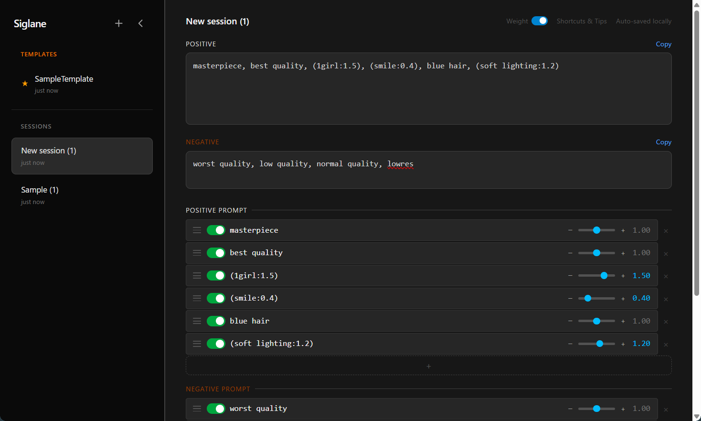

# Siglane

> Turn prompt chaos into control.

[](README.md) [](README.ja.md)

Siglane（シグレーン）は、画像生成AI向けのプロンプトを行単位で編集・整理・再利用できるWebツールです。

**[使ってみる →](https://siglane.vercel.app/)**

---

## Siglaneとは

画像生成AIのプロンプトは、カンマ区切りの長いテキストになりがちです。

```text
masterpiece, best quality, 1girl, smile, blue hair, (soft lighting:1.2)
```

Siglaneはこれを行単位に分解し、構造として扱えるようにします。



プロンプトを「書く」から「操作する」へ。

---

## 機能

### プロンプト編集

- カンマ区切りプロンプトの自動分解
- 括弧対応パーサー — `()` `[]` `<>` 内のカンマでは分割しない
- 行単位の表示・編集 — カンマ入力で自動分割、グループを継承
- ドラッグによる並べ替え
- 各行のON/OFF切り替え
- 行複製（Ctrl+D / ⌘+D）
- 重複行のハイライト — 同一タグが複数ある場合にアンバー枠で表示
- 重みコントロール — スライダー・±ボタン・数値直接入力の統合UI
- 特殊記法の実効重み表示 — `((tag))`、`(tag)`、`[tag:0.8]` などの実効値を自動計算（読み取り専用）
- Positive / Negativeプロンプト管理（折りたたみ可能）

### グループ化・整理

- 行をカテゴリ（Quality、Character、Hair、Clothingなど）に割り当て（行ごとのバッジまたはSelectモード）
- アウトラインビュー — グループ別の構造表示、折りたたみ、グループ単位ON/OFF
- フラットビュー — ドラッグ並べ替え対応のシンプルリスト
- 自動グルーピング — 過去のグループ割り当て履歴に基づきタグを自動分類
- ネガティブタグの自動検出 — 過去にネガティブプロンプトで使用されたタグを自動フラグ

### Selectモード

- P/N統合選択とスティッキーアクションバー
- 一括操作 — Set Group、ON、OFF、Ungroup、Delete、Bulk Notes
- 選択からプリセット保存 / プリセットで選択範囲を差し替え
- 複数ドラッグ移動 — Flatビューで選択中の複数アイテムをまとめてドラッグ（スタック表示オーバーレイ）
- Shift+クリックで範囲選択、グループヘッダークリックでグループ一括選択

### 辞書・プリセット

- 辞書管理ビュー — フルスクリーンでの閲覧・編集・管理、Selectモードによる一括操作
- プリセット管理 — ツリー構造のプリセットブラウザ（階層カテゴリ対応）
- グループを名前付きプリセットとして保存、既存グループをプリセットで差し替え
- 右パネルからのクイックアクセス — 編集中に辞書・プリセットをブラウズ

### アノテーション（注釈）

- タグに説明を付与（例：`masterpiece` → 「最高品質指定」）、各行の下にインライン表示
- 全セッション共通で保存
- Bulk Notes — 未登録タグをJSON形式でエクスポート、外部AIで翻訳、結果を一括インポート
- Bulk Notesフィルター — 未注釈、グループ未設定、全タグから選択
- LLM自動入力 — Ollama経由で未注釈タグを自動アノテーション（モデル・接続設定可能）

### ComfyUI連携

- ワークフローインポート/エクスポート — JSONからP/Nプロンプトと生成パラメータを自動抽出、編集後に書き戻し
- API連携 — API形式ワークフローをインポートし、ComfyUIの `/prompt` エンドポイントへ直接送信（Ctrl+Enter）
- 生成パラメータパネル — seed（ランダム/固定）、cfg、steps、sampler、scheduler、denoise、幅/高さをSiglane上で直接編集
- 解像度コントロール — 幅/高さの編集とスワップボタン（EmptyLatentImageノード検出時）
- 接続設定 — ComfyUIサーバーURLの変更・接続テスト
- 生成履歴 — ComfyUIからの生成画像をヒストリーポーリングで受信、右パネルにサムネイル表示
- PNGインポート — ComfyUI生成PNGファイルから埋め込みメタデータを抽出、セッションサムネイルに設定
- 画像ライトボックス — 生成履歴の画像をクリックで拡大表示
- お気に入り・画像ダウンロード対応

### セッション・データ管理

- セッション管理 — 複数セッションの作成・リネーム・複製・削除
- テンプレート — セッションを読み取り専用にロックし、クリックで作業コピーを作成
- フォルダ機能 — 2階層ネスト対応（プロジェクト→キャラクター→セッション）、コンテキストメニューによる移動・サブフォルダ作成、ヘッダーにフォルダパス表示
- セッションサムネイル — 最初の生成結果から自動設定
- 折りたたみ可能なサイドバー（削除確認ダイアログ付き）
- 右パネル — 折りたたみ可能なサイドパネル（History、Dictionary、Presetsタブ）
- データエクスポート/インポート — 全セッション・辞書・アノテーション・設定を単一JSONファイルとしてバックアップ・復元
- 再結合されたプロンプトの表示とワンクリックコピー
- メモ欄（seed、生成条件などの自由記述）
- 自動保存（localStorage）

### 実装予定

- プリセットのパス形式整理（例：「Misaki/casual」「Misaki/formal」）
- 共起分析 — よく一緒に使われるプロンプト要素の発見
- プロンプト履歴・差分比較
- img2imgワークフロー対応 — LoadImageノード用の画像アップロードエリア
- MCP連携 — 辞書・アノテーション・セッションを外部LLMから操作できるCRUD API
- ブラウザ拡張
- Google Driveによるクラウド同期（Pro）

---

## コンセプト

Siglaneは単なるプロンプト整形ツールではなく、プロンプトを**構造化された資産**として扱うための環境です。

### 設計の優先順位

1. 編集しやすさ
2. 再利用（辞書・プリセット）
3. 保存
4. 外部連携

### ゴール

- **MVP** ✅ — プロンプト編集が快適になる
- **v1.5** ✅ — Siglaneから直接生成＋プロンプトのグループ化
- **v2** ✅ — プロンプトが再利用可能な資産になる（プリセット＋注釈＋自動グルーピング）
- **v3** ✅ — 生成履歴、辞書ブラウジング、右パネルワークフロー
- **将来** — プロンプトの研究環境になる

---

## 想定ユースケース

- 長いプロンプトを要素ごとに整理したい
- 他人のプロンプトの構造を理解したい
- よく使うプロンプト要素を蓄積・再利用したい
- 試行錯誤のサイクルを高速に回したい
- プロジェクトやキャラクター単位でプロンプトを分類管理したい
- 成功した生成結果をプロンプト＋パラメータ＋画像ごとセッションに記録したい
- ComfyUIとのワークフローJSONによるプロンプトの往復編集
- Siglaneからの直接生成 — プロンプトを編集し、パラメータを調整してそのまま生成
- 行を役割別にグループ化し、プリセットでグループ単位の差し替え
- プロンプトタグに注釈を付けて自分だけの用語集を構築（全セッション共通）
- 外部AIやローカルLLMで未知のタグを一括翻訳し、注釈として一括登録
- 全データをバックアップとしてエクスポートし、別のデバイスにインポート

---

## 技術スタック

- React / Next.js
- TypeScript
- Tailwind CSS v4
- dnd-kit（ドラッグ＆ドロップ）
- Vercel（ホスティング）

---

## データ保存

- localStorageによる全セッション・辞書・アノテーション・設定の自動保存
- JSON形式のデータエクスポート/インポートによるバックアップ・移行
- 将来：IndexedDB移行、Google Driveによるクラウド同期

---

## はじめかた

```bash
npm install
npm run dev
```

### ComfyUI連携のセットアップ

Generate機能（Siglaneから直接ComfyUIへプロンプト送信）を使うには：

1. ComfyUIをCORS有効で起動：
   ```bash
   python main.py --enable-cors-header
   ```
2. ComfyUIの **設定 → Dev mode options を有効化**
3. **Save (API Format)** でワークフローを保存
4. Siglaneで **Generate** ボタンをクリック → API形式のJSONを読み込み
5. プロンプトや生成パラメータを編集して **Generate**（またはCtrl+Enter）で生成

---

## 開発方針

- 小さく作って、すぐに使う
- 自分自身で使い倒し、不満を次の機能にする
- 過剰な設計やUIの作り込みを避ける

---

## ライセンス

MIT
